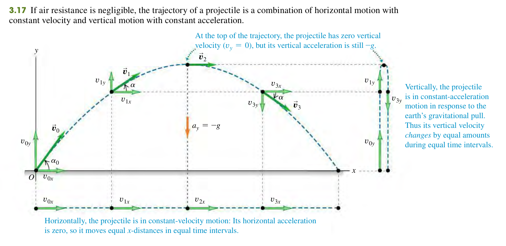
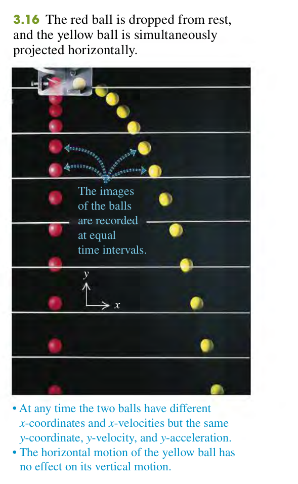
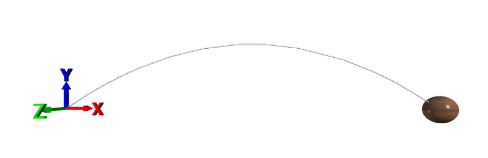
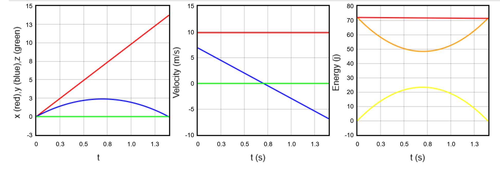
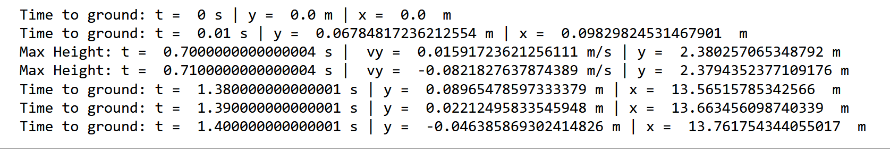
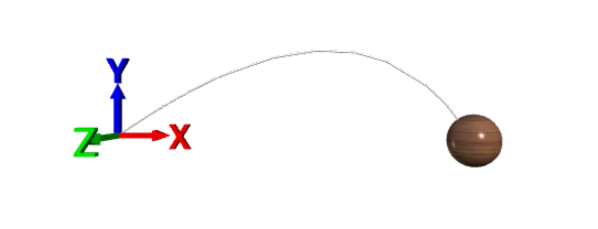
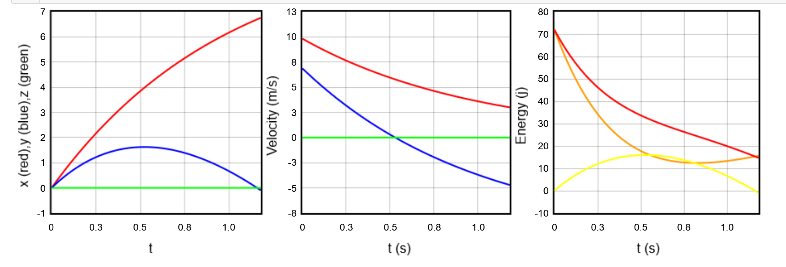
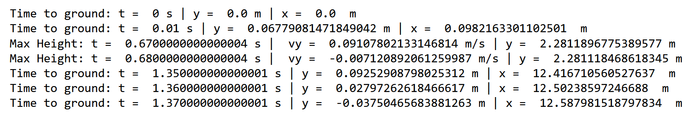

# Numerical Simulation of Projectile Motion: Exploring Trajectories and Dynamics with Euler Method

Kaelyn Isaac Parris  

kaelyn_parris@protonmail.com

June 10, 2023

[Website](https://linktr.ee/kaelyn_parris)

## Abstract

This article presents a numerical simulation of projectile motion using Newton's laws. The simulation investigates projectile motion with and without air resistance. Using the Euler method for numerical integration, the trajectory, range, maximum height, and time of flight of projectiles are analyzed under various launch conditions. The simulation results are visualized, accompanied by graphs of dynamical variables, facilitating a comprehensive understanding of the projectile's behavior throughout its motion.

## Outline

1. Introduction

   - Background on projectile motion
   - Importance of numerical simulations in studying projectile motion

2. Theoretical Framework

   - Overview of Newton's laws of motion
   - Introduction to numerical integration methods
     - Euler method
     - Brief mention of other integration methods
  - Calculating Projectile Motion
     - Solving Newton's Laws
     - Solving For Position
     - Solving For Speed
     - Solving The Magnitude Of The Position Vector
     - Solving For Maximum Range
     
  - Retarding Forces And The Need For Numerical Method
     - Retarding Forces
     - Adding In Air Drag
     - The Euler method

3. Simulation Setup

   - Timestep
   - Force Function
   - Numerical Loop
   
4. Visualization and Interpretation of Results

   - No Drag
   - Drag
   
5. Conclusion

6. References


## **Introduction**

### **Background on projectile motion**

When an object is given an initial velocity and is affected by gravitational acceleration and air resistance, it follows a specific path known as *projectile motion*. Athletes often perform this type of movement in sports like baseball, football, and shooting. The *trajectory* of a projectile is the path it takes while in motion.

To analyze projectile motion, an idealized model is often used. This model assumes that the projectile is a particle with constant acceleration due to gravity, disregarding factors like air resistance, earth's curvature, and rotation. While this model has limitations, it still provides valuable insights into projectile motion.

Projectile motion occurs in a vertical plane defined by the initial velocity's direction. Gravity purely affects the projectile's motion in the vertical direction, restricting it to two dimensions. The xy-coordinate plane is where the motion occurs, with the x-axis horizontal and the y-axis vertical. This results in a parabolic trajectory.



The key to analyzing projectile motion is treating the horizontal and vertical coordinates as separate components. The horizontal and vertical motions are independent, with the former having a constant velocity and the latter experiencing a constant downward acceleration of -g (where g is positive in the chosen coordinate system). By treating the motion as a combination of the two components, we can express the projectile's position, velocity, and acceleration as separate equations for the horizontal and vertical motions.

This is an example of the independence of perpendicular motion. An object dropped from rest will reach the ground at the same time as an object thrown horizontally from the same height.



Since the acceleration is constant we use the kinematic equations. We will start by setting up the kinematic equations and the dynamical variables so the reader understands the splitting of components and also the pattern in the equations themselves that will prove useful later. Later on we will take a "backwards" approach and use Newton's law to derive the kinematic equations and other equations we need.

### **The Kinematic Equations**

In this case the acceleration is -g in the y-direction and 0 in the x-direction. The kinematic equations in terms of x are:

$x(t) = x_0 + v_{x0}t + \frac{1}{2}a_xt^2$

$v_x(t) = v_{x0} + a_xt$

$v_x^2 = v_{x0}^2 + 2a_x(x-x_0)$

$v_x = \frac{x-x_0}{t}$

#### **Let's break down each equation.**

Due to the independence of perpendicular motion, changing components simply requires changing the subscript and x to y.

1. Displacement:
   - $x(t) = x_0 + v_{x0}t + \frac{1}{2}a_xt^2$
   - This equation relates the displacement (x) of an object to its initial velocity (v_i_x), time (t), and acceleration (a_x).

2. Final Velocity:
   - $v_x(t) = v_{x0} + a_xt$
   - This equation relates the final velocity (v_f_x) of an object to its initial velocity (v_i_x), time (t), and acceleration (a_x).

3. Velocity Squared:
   - $v_x^2 = v_{x0}^2 + 2a_x(x-x_0)$
   - This equation calculates the velocity squared (v_x^2) of an object by adding the initial velocity squared (v_i_x^2) to twice the acceleration (a_x) multiplied by the displacement (x-x_0).

4. Velocity:
   - $v_x = \frac{x-x_0}{t}$
   - This equation calculates the velocity (v_x) of an object by dividing the displacement (x-x_0) by the time (t) taken.

These equations are fundamental in analyzing the motion of objects under constant acceleration. They allow us to determine various quantities such as displacement, velocity, acceleration, and time in a given scenario.

In this case, we are interested in the motion of a projectile. We can use these equations to determine the projectile's position, velocity, and acceleration in the x and y directions.

Appying the equations to our projectile motion scenario, we get the following:

1. Horizontal motion:
   - Displacement in the x-direction: 
     - $x = x_0 + v_{0x} t$
   - Velocity in the x-direction:
     - $v_x = v_{0x}$
   - Acceleration in the x-direction:
     - $a_x = 0$

2. Vertical motion:
   - Displacement in the y-direction:
     - $y = y_0 + v_{0y} t - \frac{1}{2} g t^2$
   - Velocity in the y-direction:
     - $v_y = v_{0y} - g t$
   - Acceleration in the y-direction:
     - $a_y = -g$

From these core kinematic equations we can derive other useful equations for projectile motion.

#### **Maximum height**

The maximum height is reached when the vertical velocity is zero. Therefore, we can set the vertical velocity to zero and solve for t. This gives us the time at which the projectile reaches its maximum height.

$v_y = v_{0y} - g t$

$0 = v_{0y} - g t$

$t = \frac{v_{0y}}{g}$

Substituting this value of t into the equation for vertical displacement gives us the maximum height.

$y = y_0 + v_{0y} \frac{v_{0y}}{g} - \frac{1}{2} g \frac{v_{0y}^2}{g^2}$

$y = y_0 + \frac{v_{0y}^2}{g} - \frac{v_{0y}^2}{2g}$

$y = y_0 + \frac{v_{0y}^2}{2g}$

Therefore, the maximum height reached by the projectile is given by:

$y_{max} = y_0 + \frac{1}{2} \frac{v_{0y}^2}{g}$

#### **Time of Flight:**

The time of flight, T, is defined as the time taken by the projectile to reach the ground. This time is given by:

$T = \frac{2v₀ sin(θ)}{g}$

where:
- v₀ is the initial velocity of the projectile
- θ is the launch angle
- g is the acceleration due to gravity

Deriving the time of flight is a simple matter of finding the time at which the projectile hits the ground. This can be done by setting the vertical displacement to zero and solving for t.

$y = y₀ + v₀ sin(θ) t - \frac{1}{2} g t²$

$0 = y₀ + v₀ sin(θ) t - \frac{1}{2} g t²$

$0 = t (v₀ sin(θ) - \frac{1}{2} g t)$

$t = 0$

$v₀ sin(θ) - \frac{1}{2} g t = 0$

$t = \frac{2 v₀ sin(θ)}{g}$

$T = \frac{2 v₀ sin(θ)}{g}$

#### **Range:**

The range in projectile motion refers to the horizontal distance traveled by the projectile before it lands back on the same level as its initial launch point.

The range, R, in projectile motion is given by:

$R = \frac{v₀² sin(2θ)}{g}$


where:
- v₀ is the initial velocity of the projectile
- θ is the launch angle
- g is the acceleration due to gravity

The derivation for the range is as follows:

$R = v₀ cos(θ) t$

$R = v₀ cos(θ) \frac{2v₀ sin(θ)}{g}$

$R = \frac{2v₀² sin(θ) cos(θ)}{g}$

$R = \frac{v₀² sin(2θ)}{g}$

#### **Maximum Height Redux** 

Now that we have an expression for t, we can simplify our previous expression for maximum height even further.

$H_{max} = \frac{v₀² sin²(θ)}{(2g)}$


where:
- v₀ is the initial velocity of the projectile
- θ is the launch angle
- g is the acceleration due to gravity

The derivation for maximum height is as follows:

$H_{max} = v₀ sin(θ) t - \frac{1}{2} g t²$

$H_{max} = v₀ sin(θ) \frac{2v₀ sin(θ)}{g} - \frac{1}{2} g (\frac{2v₀ sin(θ)}{g})²$

$H_{max} = \frac{2v₀² sin²(θ)}{g} - \frac{4v₀² sin²(θ)}{g}$

$H_{max} = \frac{v₀² sin²(θ)}{(2g)}$

### Importance of numerical simulations in studying projectile motion

Projectile motion is often taught as a fundamental concept in physics education to help students learn about motion and gravity. This involves launching objects into the air and observing their curved paths, which gravity influences solely. However, projectile motion can become more complex when it comes to realistic calculations.

One of the main challenges with projectile motion is the absence of a straightforward analytical solution. Projectile motion lacks a closed-form solution Unlike other problems with precise equations describing position, velocity, and acceleration as time functions. This is due to the inclusion of air resistance, which significantly impacts the object's trajectory.

When air resistance cannot be ignored, calculating the trajectory becomes more challenging because the effects of air resistance are velocity-dependent. As a result, the acceleration is no longer constant. 

To accurately model and predict projectile motion, computer simulations are essential. Simulations use numerical integration methods to solve the equations of motion, accounting for gravity, air resistance, and other relevant forces. Simulations provide a step-by-step approximation of the projectile's motion by discretizing time and iteratively updating the object's position and velocity.

Simulations have several advantages when dealing with the complexities of realistic projectile motion. They allow for incorporating intricate mathematical models that consider the changing effects of air resistance as the object moves through the air. Additionally, simulations provide a flexible framework for exploring different scenarios by adjusting launch angles, initial velocities, and environmental conditions.

Visualizations provided by simulations enhance the understanding of projectile behavior. Dynamic plots of trajectory, velocity, and other relevant quantities over time show how factors like air resistance impact the projectile's path. This visual feedback fosters a comprehensive comprehension of the complex behavior exhibited by projectiles.

Simulations can also encompass more complex scenarios involving multiple projectiles or interactions with obstacles, allowing for exploring various strategies, such as optimizing launch parameters to achieve specific objectives like maximum range or height.

## Theoretical Framework

### Overview of Newton's Laws of Motion
Newton's laws of motion provide a fundamental framework for understanding the motion of objects. These laws, formulated by Sir Isaac Newton in the 17th century, describe the relationship between the motion of an object and the forces acting upon it. The three laws are:

1. **Newton's First Law (Law of Inertia):** An object at rest will remain at rest, and an object in motion will continue in motion with constant velocity unless acted upon by an external force.

2. **Newton's Second Law (Law of Acceleration):** The acceleration of an object is directly proportional to the net force applied to it and inversely proportional to its mass.

3. **Newton's Third Law (Law of Action-Reaction):** For every force there is an force paired with it that is equal in magnitude and opposite in direction.

Understanding Newton's laws of motion is crucial for analyzing the behavior of projectiles and predicting their trajectories under the influence of external forces such as gravity and air resistance.

### Introduction to Numerical Integration Methods
Numerical integration methods play a vital role in simulating and analyzing projectile motion. These methods provide a means to approximate the behavior of objects by discretizing time and numerically calculating their positions, velocities, and accelerations at discrete time intervals.

#### Euler Method
One commonly used numerical integration method is the Euler method. It is a straightforward approach that approximates the derivative of a function using finite differences. In the context of projectile motion, the Euler method can be employed to numerically integrate the equations of motion and determine the trajectory of the projectile.

The Euler method involves dividing the time interval into small steps and updating the position and velocity of the projectile based on the current values and the calculated acceleration at each time step. While the Euler method is relatively simple to implement, it has some limitations, such as accumulating error over long integration periods and being sensitive to step size.

The mathematics behind the Euler method will be discussed in more detail in the next section, where we dive into the math details.

#### Brief Mention of Other Integration Methods
In addition to the Euler method, various other numerical integration methods exist, offering different levels of accuracy and stability. Some commonly used integration methods in the context of projectile motion include:

- **Runge-Kutta Methods:** These are a family of numerical integration methods that provide higher accuracy compared to the Euler method by considering multiple intermediate steps. The fourth-order Runge-Kutta (RK4) method is particularly popular for its balance between accuracy and computational efficiency.

- **Verlet Integration:** Verlet integration is a symplectic integration method commonly used for simulating conservative systems. It can be advantageous in certain cases where energy conservation is important.

- **Adaptive Integration Methods:** These methods dynamically adjust the step size during the integration process to maintain a desired level of accuracy. Adaptive integration can help mitigate error accumulation and improve the efficiency of simulations.

## **Calculating Projectile Motion**

With the foundational material out of the way we can begin setting the stage for our specific problem, and where the necessity of the simulation will come into play.

To begin with, we will explore projectie motion without drag, introduce retarding forces, adn then finally introduce drag.

### **Projectile Motion Without Drag**

#### **Solving Newton's Laws**

Newton's second law for projectile motion in two dimensions is as follows:

$\vec{F} = m \vec{a} = m \vec{g}$

Using the independence of perpendicular motion, we split the forces into x and y components. And since the only force acting on the projectile is gravity, the x-direction will not have any resulting force.

$F_x = m \ddot{x} = 0$

$F_x = m \ddot{y} = -mg$

Where the constant of gravity is given to three significant figures: $g = 9.81 m/s^2$

Reviewing the dynamical variables for our system we have the following:

| Dynamical Variable | X-Direction (Subscript) | Y-Direction (Subscript) |
| ----------------- | ---------------------- | ---------------------- |
| Initial position  | $x_0$                  | $y_0$                  |
| Final position    | $x$                    | $y$                    |
| Initial velocity  | $v_{0x}$               | $v_{0y}$               |
| Final velocity    | $v_x$                  | $v_y$                  |
| Acceleration      | $a_x$                  | $a_y$                  |
| Time              | $t$                    | $t$                    |


#### **Solving For Position**

Given that x = y = 0 at t = 0, since the particie is at the origin at this time. We can integrate the equations of motion to find the position of the particle at any time t.

$\ddot{x} = a_x = 0$

$\dot{x} = \int_{0}^{t} a_x dt = v_{0x} + C = v_0 cos\theta + C$

$x = \int_{0}^{t} v_x dt = v_{0x}t + C_1 = v_0 cos\theta t + C_1$

Using the initial conditions we can solve for the constants of integration. In this case, since x = 0 at t = 0, we have:

$x = v_0 cos\theta (0) + C = 0$

$C = 0$

So the final equation of motion for the x-direction is:

$x = v_0 cos\theta t$

The same process can be used to solve for the y-direction:

$\ddot{y} = a_y = -g$

$\dot{y} = \int_{0}^{t} a_y dt = v_{0y} + C = v_0 sin\theta - gt + C$

$y = \int_{0}^{t} v_y dt = v_{0y}t + C_1 = v_0 sin\theta t - \frac{1}{2}gt^2 + C_1$

Using the initial conditions we can solve for the constants of integration. In this case, since y = 0 at t = 0, we have:

$y = v_0 sin\theta (0) - \frac{1}{2}g(0)^2 + C = 0$

$C = 0$

Just like before.

Moving forward, a similar process will be used to determine the constants of integrations, and the details will be skipped for brevity. The process of determining the constants of integration involves examining the initial conditions of the system, and then solving for the constants of integration that satisfy those conditions.

The final equation of motion for the y-direction is:

$y = v_0 sin\theta t - \frac{1}{2}gt^2$

#### **Solving For Speed**

The speed of the projectile can be found by taking the magnitude of the velocity vector:

$v = \sqrt{v_x^2 + v_y^2}$

In this case, we have solved for the velocity already in the x and y directions, so we can substitute those equations into the speed equation:

$v = \sqrt{(v_0 cos\theta)^2 + (v_0 sin\theta - gt)^2}$

Working out the algebra we get:

$v = \sqrt{v_0^2 - 2v_0 sin\theta gt + g^2t^2}$

#### **Solving For The Magnitude of the Position Vector**

The position vector is a vector that points from the origin to the position of the particle as it changes. To find the distance from the origin to the particle, we can take the magnitude of the position vector:

$r = \sqrt{x^2 + y^2}$

In this case, we have solved for the position already in the x and y directions, so we can substitute those equations into the position equation:

$r = \sqrt{(v_0 cos\theta t)^2 + (v_0 sin\theta t - \frac{1}{2}gt^2)^2}$

Working out the algebra we get:

$r = \sqrt{v_0^2t^2 - 2v_0 sin\theta t^3 + \frac{1}{4}g^2t^4}$

#### **Solving For Maxiumum Range**

Finally we will get the maximum range equation. Following the same steps as before we have:

$x = v_0 cos\theta t$

$x = v_0 cos\theta \frac{2v_0 sin\theta}{g}$

$x = \frac{2v_0^2 sin\theta cos\theta}{g}$

And converting this into a double angle we get:

$x = \frac{v_0^2 sin(2\theta)}{g}$

From this we also see tht the maximum range occurs when $sin(2\theta) = 1$, which occurs when $\theta = 45^{\circ}$

Lastly we will do the same but in the y-direction:

$y = v_0 sin\theta t - \frac{1}{2}gt^2$

$y = v_0 sin\theta \frac{2v_0 sin\theta}{g} - \frac{1}{2}g(\frac{2v_0 sin\theta}{g})^2$

$y = \frac{2v_0^2 sin^2\theta}{g} - \frac{2v_0^2 sin^2\theta}{g}$

$y = 0$

This quick calculation shows that the maximum range refers to the distance traveled in the horizontal direction, as the vertical direction ends up at the same height as it started.

### **Retarding Forces And The Need For Numerical Methods**

At this point, all the system's dynamical variables have been solved. The equations following the model configurations provide all the information about the system. Integrating air drag makes things interesting, as it no longer allows for a closed-form equation solution. Approximation methods become necessary in this case.

#### **Retarding Forces**

A retarding force is a force that acts in the opposite direction of the motion of the particle. In the case of projectile motion the retarding force is air drag.

But handling drag, or any other retarding force is the same as handling multiple forces, the superposition principle applies. So we can add the retarding force to the equation of motion:

$\sum \vec{F} = \vec{F_g} + \vec{F_r}  = m\vec{g} + \vec{F_r}(v)$

In this case the rearding force is a function of the velocity of the particle. We usually aprooximate the retarding force as some power of velocity. Keep in mind this by itself, is another approximation in our model, and retarding forces are usually far more complicated.

Where this model is useful is where the speed doesn't vary greatly. 

##### **The Power Law Approximation**

The power law approximation is a common approximation for retarding forces. It is given by:

$\vec{F_r} = -kv^n$

Where k is the strength of the retarding force, and n is a power.

Where the velocity is less than 24 m/s `n` is taken to be 1, and for velocities between 24 m/s and the speed of sound `n` is taken to be 2.

##### **Air Drag**

Air resistance is called drag. It is a retarding force that is proportional to the square of the velocity of the particle and points opposite to the direction of motion. 

Keep in mind we are only adding in one other force that would be acting on an object undergoing projectile motion. There are also non-conservative forces from;

* Lift - this is perpendicular to drag and is caused by the shape of the projectile
* Spin from the projectile
* Oscillation of the projectile

Also, the velocity usually doesn't point along the symmetry access of the projectile. 

So for our cases we will take the power of the retarding force to be 2. From here we can integrate the retarding force into our previous calculation, and see how it diverges.

### Adding in air drag

Compared to before Newotn's equations of motions for projectile motion with air drag included are now:

$F_x = m \ddot{x} = -km\dot{x}$

$F_x = m \ddot{y} = - km\dot{y} -mg $

And our initial conditions are:

$x(t = 0) = 0 = y(t = 0)$

$\dot{x}(t = 0) = v_0 cos\theta \equiv U$

$\dot{y}(t = 0) = v_0 sin\theta \equiv V$

In order to solve the force in the x direction we have to use separation of variables:

$\frac{d\dot{x}}{dt} = -k\dot{x}$

$\frac{d\dot{x}}{\dot{x}} = -kdt$

$\int_{U}^{\dot{x}} \frac{d\dot{x}}{\dot{x}} = -k\int_{0}^{t}dt$

$ln(\dot{x}) - ln(U) = -kt$

$ln(\frac{\dot{x}}{U}) = -kt$

$\frac{\dot{x}}{U} = e^{-kt}$

$\dot{x} = Ue^{-kt}$

Now we can integrate this to get the position in the x direction:

$\int_{0}^{x} dx = \int_{0}^{t} Ue^{-kt}dt$

$x = \frac{U}{k}(1 - e^{-kt})$


Now we can solve for the force in the y direction:

$\frac{d\dot{y}}{dt} = -k\dot{y} - g$

$\frac{d\dot{y}}{\dot{y} + \frac{g}{k}} = -kdt$

$\int_{V}^{\dot{y}} \frac{d\dot{y}}{\dot{y} + \frac{g}{k}} = -k\int_{0}^{t}dt$

$ln(\dot{y} + \frac{g}{k}) - ln(V + \frac{g}{k}) = -kt$

$\frac{\dot{y} + \frac{g}{k}}{V + \frac{g}{k}} = e^{-kt}$

$\dot{y} + \frac{g}{k} = (V + \frac{g}{k})e^{-kt}$

$\dot{y} = (V + \frac{g}{k})e^{-kt} - \frac{g}{k}$

Now we can integrate this to get the position in the y direction:

$\int_{0}^{y} dy = \int_{0}^{t} ((V + \frac{g}{k})e^{-kt} - \frac{g}{k})dt$

$y = \frac{V + \frac{g}{k}}{k}(1 - e^{-kt}) - \frac{g}{k}t$

Our last equation is in place. Now in order to find the time T required for the entire trajectory we need to find the time when y = 0 and t = T. This is given by:

$0 = \frac{V + \frac{g}{k}}{k}(1 - e^{-kT}) - \frac{g}{k}T$

$\frac{V + \frac{g}{k}}{k}(1 - e^{-kT}) = \frac{g}{k}T$

$T = \frac{kV + g}{gk}(1 - e^{-kT})$

This is a transcendental equation and cannot be solved analytically. We can solve it numerically however. Two methods that will be discussed are the perturbation method, which we will use as a baseline, and the Euler method, which is what is implemented in the simulation.

### **Using The Euler Method To Solve The Transcendental Equation Numerically**

The first step to solving a differential equation using numerical methods is to convert the differential equation into a difference equation. A difference equation is an equation that relates the values of a function to the previous values of the function.

The most straightforward difference equation is a first-order difference equation, which the following initial value problem can represent:

```
dy/dt = f(t, y)
y(t = 0) = y_0
```

Here, `t` represents the independent variable, `y` represents the unknown function, and `f(t, y)` denotes the derivative of `y` with respect to `t`.

The Euler Method is a first-order numerical approximation technique that approximates the solution of the above difference equation. It involves dividing the interval of interest into smaller subintervals and updating the approximate values of `y` at each step using the following equation:

```
y(t + Δt) = y(t) + Δt * f(t, y)
```

Here, `Δt` represents the step size, `y(t)` is the approximate value of `y` at time `t`, and `y(t + Δt)` is the updated approximate value at `t + Δt`.

The Euler Method is called a first-order method because it is accurate to the first order in `Δt`.

All the background mathematics have been laid out. From here the article will describe the simulation.

## Simulation Setup

The simulation is written using Python and implements the VPython framework for visualization. The code was originally visualized in Glowscript, a website that allows the user to execute code with VPython statements in it from the browser. It has since been moved to Jupyter Notebook for presentation, but still running the program in Glowscript provides the best experience. 

In order to use VPython in a Jupyter Notebook the following import statement is required:


```python
import vpython import *
```

From here, the rest of the simulation code is straightforward. The author wants to highlight specific parts of the code that are important to the simulation.

The first is the timestep. 

#### Timestep

When using the Euler method for numerical integration, the choice of timestep `(dt)` plays a crucial role in determining the accuracy and stability of the results. The timestep represents the size of each time increment used in the numerical approximation.

The Euler method approximates the solution of a differential equation by updating the values of the dependent variable at discrete time intervals based on the current values and the derivative. The update equation in the Euler method is given by:

```
y(t + dt) = y(t) + dy/dt * dt
```

The choice of timestep affects the accuracy and precision of the numerical approximation. If the timestep is too large, the Euler method may introduce significant errors in the solution. This is because the method assumes the derivative is constant over the entire timestep, which may not hold for rapidly changing functions or complex systems.

When the timestep is small, the Euler method provides a better approximation by capturing finer details and reducing the truncation error. Smaller timesteps allow for more frequent updates of the dependent variable, resulting in a more accurate approximation of its behavior.

For the simulation expressly, the timestep is set to 0.01. This is a good value for the simulation because it is small enough to provide a good approximation of the solution but not so small that it takes a long time to run.

#### Force Function

Next up is the force function. 

Here is the version without drag.


```python
def Fnet():

    Fnetx = 0 
    Fnety = -m*g 
    Fnetz = 0 
    
    return vector(Fnetx, Fnety, Fnetz)
```

Here the only necessary information to calculate the force is the graviational constant g, since the force is constant. 

Here is the version with drag.


```python
def Fnet(v): # since we are calculating drag we need the velocity

    Fdrag_mag = m*v.mag # [N].

    vuv = v/v.mag #Calculate a unit vector in the direction of the velocity.
    Fnetx = -vuv.x * Fdrag_mag 
    Fnety = -m*g - vuv.y * Fdrag_mag 
    Fnetz = -vuv.z * Fdrag_mag 
    
    return vector(Fnetx, Fnety, Fnetz)
```

Here the calculation becomes more involved. Since drag depends on the projectile's velocity, we have to pass velocity in as a function argument. Then the unit vector in the velocity direction is calculated, the magnitude of the drag using the power law approximation, and then the two are multiplied by each other to get the drag force vector.

Since the vector must point in the opposite direction of the velocity, we multiply the drag force vector by -1. Then the function returns the resultant force as a vector.

#### Numerical Loop

Lastly we have the numerical loop. This is where the Euler method is implemented. The loop is shown below:


```python
while r.y >= -0.1: # Stop the simulation when the projectile hits the ground.
    ball.pos = r # update the position of the projectile with every iteration of the loop

    # plots the position of the projectile as the time changes
    plot_x.plot(pos=(t,r.x))
    plot_y.plot(pos=(t,r.y))
    plot_z.plot(pos=(t,r.z))
    
    # Plots the velocity of the projectile as the time changes.
    plot_vx.plot(pos=(t,v.x)) 
    plot_vy.plot(pos=(t,v.y))
    plot_vz.plot(pos=(t,v.z))
    
    T = (0.5)*m*v.mag**2
    U = m*g*r.y
    # Plots the energy of the projectile as the time changes.
    plot_T.plot(pos=(t,T))
    plot_U.plot(pos=(t,U))
    plot_H.plot(pos=(t,U+T))

    # Report information about projectile 
    if(v.y < 0.1 and v.y > -0.1):
        print('Max Height: t = ',t,'s | ','vy = ', v.y ,'m/s | y = ', r.y ,'m')
    if(r.y < 0.1 and r.y > -0.1):
        print('Time to ground: t = ' , t , 's | y = ' , r.y , 'm | x = ', r.x ,' m')
        
    # Use Newton's 2nd Law to update the ball's position and velocity.
    t = t + dt 
    f = Fnet(v)
    a = f/m 
    v = v + a*dt 
    if v.mag > 24:
        # This check is used to make sure the velocity does not exceed 24 m/s
        # If it does, the power used must change from 1 to 2
        print("velocity above 24 m/s")
    r = r + v*dt 
 
    sleep(dt)
```

Notice that we calculate the acceleration using the force function and then use it to update the velocity and position before starting the loop again.

## Visualization And Interpretation Of Results

### No Drag





From here, we can see that the energy changes from kinetic to potential energy, then back to kinetic energy. The energy of the system as a whole remains constant since there is no non-conservative work.

### Drag





One noticeable contrast between the two simulations is that the projectile with drag has a significantly reduced range compared to the one without. This is because the drag force is directly proportional to the square of the velocity. Therefore, as the velocity increases linearly, the drag force increases quadratically. This results in the projectile losing its speed at a higher rate than the one without drag.

One notable distinction is that the system's energy is no longer consistent due to non-conservative work. The drag force is responsible for this non-conservative work, resulting in a gradual decrease in the system's energy over time.

## Conclusion

In conclusion, the Euler method is a straightforward and effective way to solve differential equations numerically. It is straightforward to implement and can solve various differential equations. It is also straightforward to implement in a simulation. 

By visualizing the two situations and comparing them, we gain valuable insights into the physical situation of projectile motion. We can immediately see a difference both in energy and range. Remember that the Euler method is not the most accurate for solving differential equations. Many other methods are more accurate and can solve more complex differential equations. However, the Euler method is a good starting point and can be used to gain a basic understanding of the situation.

The primary thing to remember is that the projectile motion of actual physical objects is much more complicated than the simple model presented here, even with the drag taken into account and turning the model into one that can no longer be solved analytically. 
   
In reality, many other forces are acting on the projectile. We need to add these forces to the simulation to obtain a more accurate projectile motion model. However, we can take this simulation as a starting point and build upon it to create a more accurate model.   

## References

* Holley, Adam. "Computational Physics." PHYS 4130. Tennessee Technological University, Fall 2022.
* LibreTexts. "Projectile Motion." Accessed June 10, 2023. https://phys.libretexts.org/Bookshelves/University_Physics/Book%3A_Physics_(Boundless)/3%3A_Two-Dimensional_Kinematics/3.3%3A_Projectile_Motion.
* Chabay, Ruth, and Bruce Sherwood. “GlowScript and Jupyter: VPython in a Browser (Vpython.Org),” n.d.
* Physics LibreTexts. “3.3: Projectile Motion,” April 12, 2018. https://phys.libretexts.org/Bookshelves/University_Physics/Book%3A_Physics_(Boundless)/3%3A_Two-Dimensional_Kinematics/3.3%3A_Projectile_Motion.
* Thornton, Stephen T., and Jerry B. Marion. Classical Dynamics of Particles and Systems. 5th ed. Belmont, CA: Brooks/Cole, 2004.
* “Web VPython.” Accessed June 11, 2023. https://www.glowscript.org/.
* Young, Hugh D., Roger A. Freedman, and Hugh D. Young. University Physics with Modern Physics. 15th edition. Hoboken, N.J: Pearson Higher Education, 2020.
 
